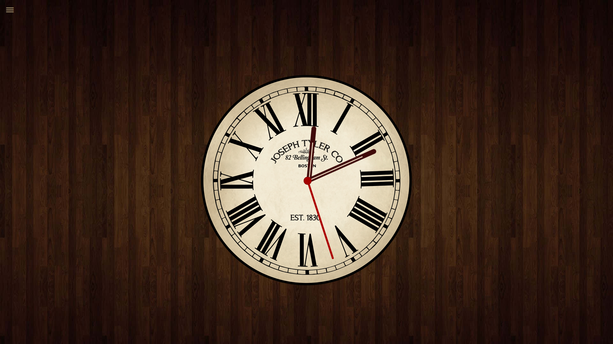

# Analog clock

This is a simple analog clock web app built for learning and practice purposes, and I hope you find it interesting.

It features a clean layout with subtle animations to replicate the motion of a **real clock**. Designed as part of my front-end learning journey.

## Preview

## Demo

You can check out the final version here: [Live demo](https://pixedit-dev.github.io/Analog-Clock/)

## Built With

- HTML5
- CSS3
- Vanilla JavaScript (ES6)

## Features

- Responsive across different screen sizes
- Smooth analog hand animation
- Minimalist design inspired by modern dashboards
- Menu links will be updated soon

## Upcoming features

- Enhanced design and layout
- Options to manipulate background style
- A digital clock displayed beneath the analog interface
- Menu links will be updated

## Author

Milad - [GitHub profile](https://github.com/pixedit-dev)
